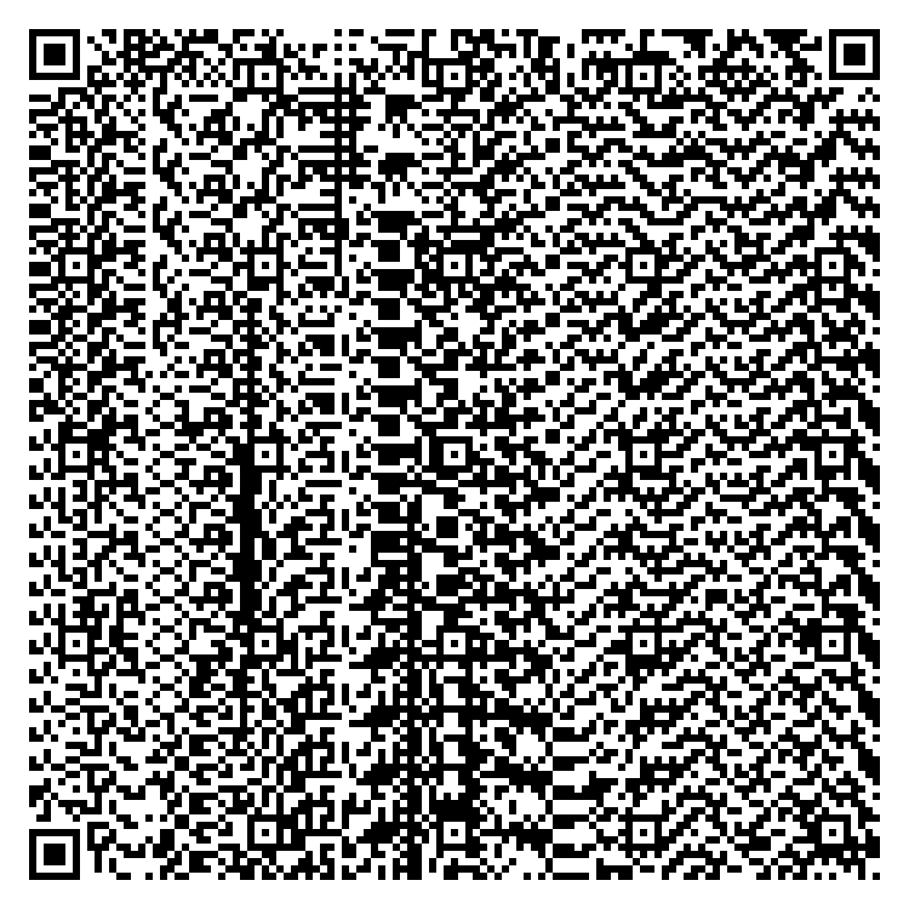
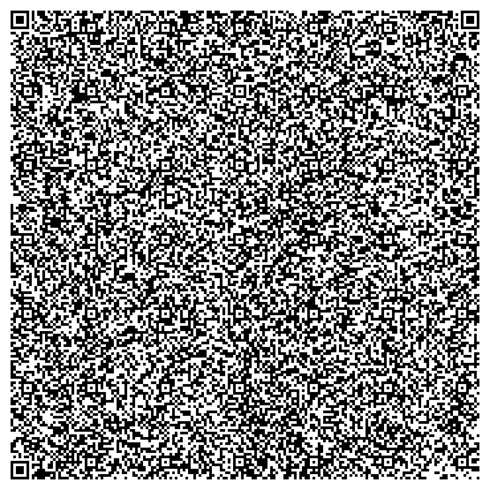
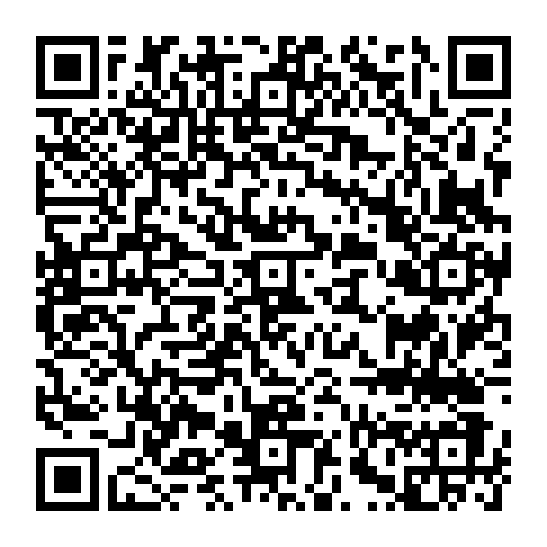

# QR-IO


## Description

QR-IO is a mini-library for QR code generation & reading.
It is based on the ISO/IEC 18004:2015 standard.
The project utilizes OpenCV2 to generate the QR images.
Currently supports generating QR codes only.

## Features

- Easy-to-use C++ interface.
- Utilizes the OpenCV library for image processing and QR code generation.
- Generates high-quality QR code images.
- Supports the most efficient encoding for all strings that are either pure Kanji or do not contain any Kanji.
- Supports automatic encoding.
- Supports manual ECI usage.
- Supports manual structured append without ECI.
- Supports FNC1 encoding.

## Upcoming features

- QR reading.
- Automatic structured append.
- Automatic Kanji encoding.

## Requirements

Before running the program, ensure you have the following installed on your system:

- C++ Compiler that supports C++20.
- OpenCV2
- CMake

## Usage

1. Clone the QR-IO repository to your local machine.
2. Add your main to the directory.
3. Modify the following section in the [CMakeLists.txt](./CMakeLists.txt) file:
  ```text
      ... 
      add_executable(
        QR_IO
        demo.cpp <- Replace with the name of your main file and add your files
      ...
  ```
5. Navigate to the directory & run the following commands:
   - `cmake .`
   - `make`
      - On Unix:    `./QR_IO`
      - On Windows: `.\QR_IO`

- You can check the [demo.cpp](./demo.cpp) for example usage.
- You can also use the pre-compiled executables included in the project.

## Example QRs 

- "This is a test" (1-L):
  
     

- "This is a test" (1-M):
 
    


- "This is a test" (1-Q):
 
    

- "This is a test" (1-H):
 
    

- "This is a test" (25-H):
 
    

- "This is a test" (1-H):
 
    

- "This is a test" (1-H):
 
    

- Check qrw_1 in [demo.cpp](./demp.cpp):
 
    

- Check qrw_2 in [demo.cpp](./demp.cpp):
 
    

- "This is a Kanji test: \u935F\uE4AA\u89D7\uE4AA!":
 
    

- "You can also use regular strings!":
 
    

- An innocent google search link ;) (non-malicious):
 
    

- "Hello world!" in binary:

    
